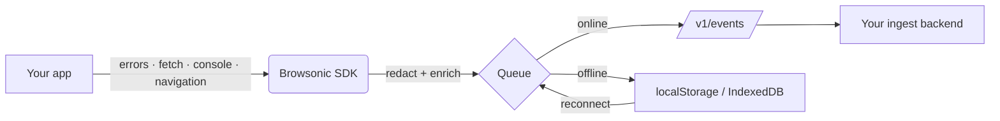

# Browsonic SDK

[](https://www.npmjs.com/package/@browsonic/sdk)
[](https://www.npmjs.com/package/@browsonic/sdk)
[](./LICENSE)
[](https://github.com/Sangaibisi/browsonic-sdk/actions/workflows/ci.yml)
[](https://bundlephobia.com/package/@browsonic/sdk)
[](https://docs.npmjs.com/generating-provenance-statements)

> **Privacy-first browser RUM & error tracking.** ~15 KB gzipped, no runtime dependencies, framework-agnostic, and no PII captured by default.

The browser is the noisiest place to debug. Every JavaScript error, failed network call, and slow API response happens on a device you don't control, in a session you can't replay. Browsonic captures that surface — without spying on your users — and ships it to a backend you control.

```bash
npm install @browsonic/sdk
```

```ts
import { Browsonic } from '@browsonic/sdk';

new Browsonic().init({
  apiEndpoint: 'https://your-ingest.example.com',
  appKey: 'your-app-key',
});
```

That's it. JavaScript errors, unhandled promise rejections, console errors, and failed network requests are now captured automatically.

---

## ✨ Highlights

- 📦 **Tiny.** 14 KB core, 21 KB with the in-app widget — both gzipped. Zero runtime dependencies.
- 🛡️ **Fail-safe.** Internal errors never crash the host page. A circuit breaker pauses collection on repeated SDK failures.
- 🔒 **Privacy-first defaults.** No input values stored. No cookie values captured. Storage capture off by default. Password fields skipped entirely.
- 🔌 **Plugin architecture.** Opt into only the collectors you need; the `@browsonic/sdk/core` entry drops the widget code from your bundle.
- 📡 **Offline-ready.** Three-stage queue (`localStorage` → IndexedDB → in-memory) survives network drops, quota exhaustion, and private-mode browsers.
- 🔭 **Self-observable.** Optional `internalDiagnostics: true` posts the SDK's own init / event-process / flush latency percentiles back to your backend.
- 🌐 **Universal.** ES modules, CommonJS, and a UMD bundle for `<script>` / CDN. Works with React, Vue, Angular, Astro, Next.js, vanilla JS — anything that runs in a browser.
- 🔐 **Supply-chain transparent.** Every release ships with [npm provenance](https://docs.npmjs.com/generating-provenance-statements), a CycloneDX SBOM, and SHA-256 checksums.

---

## 🚀 Usage

```ts
import { Browsonic } from '@browsonic/sdk';

const sdk = new Browsonic();

sdk.init({
  apiEndpoint: 'https://your-ingest.example.com',
  appKey: 'your-app-key',

  // Tag events with your release
  clientVersion: '1.0.0',

  // Filter or enrich events before they leave the browser
  onError: (event) => {
    if (event.message?.includes('benign')) return false; // drop
    return event;
  },
});

// Identify the user (no PII leaves the browser without your `apiEndpoint` consenting)
sdk.setUser({ id: 'user-123', plan: 'pro' });

// Manual capture
sdk.captureMessage('user reached checkout');
sdk.captureError(new Error('payment provider timed out'));
```

Framework adapters (React Error Boundary, Vue plugin, Next.js wiring), every configuration option, and the full ingest contract live in **[INTEGRATION.md](./INTEGRATION.md)**.

---

## 🔒 Privacy by default

The SDK is designed so the **safest configuration is the default**. To capture more, you opt in.

| Default                                            | Behaviour                                                                                                    |
| -------------------------------------------------- | ------------------------------------------------------------------------------------------------------------ |
| `captureStorage: { local: false, session: false }` | `localStorage` / `sessionStorage` snapshots disabled.                                                        |
| `captureCookieValues: false`                       | Cookie _names_ are attached to events; values are stripped.                                                  |
| Input value capture                                | Never. Only patterns (`email`, `numeric`, …) and length are recorded.                                        |
| Password fields                                    | Skipped entirely — no event records they exist.                                                              |
| `redactKeys`                                       | `token`, `password`, `authorization`, `secret`, `key`, `credential`, `auth` redacted everywhere they appear. |
| `respectGPC: true`                                 | Honours `navigator.globalPrivacyControl` automatically.                                                      |
| `hasConsented()` hook                              | Host-supplied consent gate — nothing leaves the browser until it returns true.                               |

Full guarantees and the reasoning behind them: **[PRIVACY.md](./PRIVACY.md)**.

---

## 📊 Performance

Numbers from the v2.2.0 release. Reproduce locally with `npm run build && npm run size && npx playwright test`.

| Metric                                          | Budget      | v2.2.0                   |
| ----------------------------------------------- | ----------- | ------------------------ |
| Main entry (ESM, gzipped)                       | 22 KB       | **20.96 KB**             |
| Core entry — no widget (ESM, gzipped)           | 15 KB       | **13.95 KB**             |
| `init()` blocking time (desktop)                | ≤ 15 ms p95 | **0.30 ms**              |
| `init()` on Moto G4 emulation (6× CPU throttle) | ≤ 15 ms     | **2.70 ms**              |
| LCP delta vs no-SDK (10-iter median)            | ≤ 50 ms     | **-2 ms** (within noise) |
| CLS delta                                       | ≤ 0.01      | **0**                    |
| Heap delta (2-minute burst)                     | ≤ 2.5 MB    | **0 MB**                 |
| Long tasks during 2 s idle                      | 0           | **0**                    |

Full methodology, microbenchmarks, and CI gates: **[BENCHMARKS.md](./BENCHMARKS.md)**.

---

## 🌐 Browser support

Evergreen browsers from the last two years. The UMD bundle targets ES2018 for legacy CMS / WordPress / Shopify embeds.

| Engine                     | Minimum |
| -------------------------- | ------- |
| Chromium / Edge            | 80      |
| Firefox                    | 75      |
| Safari                     | 13.1    |
| Node (for tests + tooling) | 20      |

CDN copy-paste:

```html
<script src="https://cdn.jsdelivr.net/npm/@browsonic/sdk@2/dist/umd/browsonic.min.js"></script>
<script>
  window.Browsonic.getBrowsonic().init({
    apiEndpoint: 'https://your-ingest.example.com',
    appKey: 'your-app-key',
  });
</script>
```

---

## 🏗️ How it works



1. **Capture.** Browser-native APIs are wrapped: `window.onerror`, `unhandledrejection`, `fetch`, `XMLHttpRequest`, `console`, `history`.
2. **Enrich.** Each event gets browser context, viewport, session id, user id (if set), and the last N telemetry entries (console + network).
3. **Redact.** Sensitive keys are masked, password fields skipped, cookie values stripped — before the event is queued.
4. **Batch & deliver.** Events are batched (default: 25 events / 50 KB / 10 s) and posted to your `apiEndpoint`. On failure the batch persists locally and retries when the network returns.

The receiving end is **your problem to host or buy.** The SDK has no hardcoded endpoint.

---

## 📚 API at a glance

```ts
const sdk = new Browsonic();

sdk.init(config); // Initialise; call once per page
sdk.captureMessage('something happened'); // Manual event
sdk.captureError(new Error('boom')); // Manual error

sdk.setUser({ id, email, plan }); // Identify user (apply your own PII rules)
sdk.clearUser();

sdk.addMetadata('feature_flags', flags);
sdk.removeMetadata('feature_flags');

sdk.flush(); // Force the pending batch
sdk.pause();
sdk.resume(); // Stop / start capture

sdk.enterCriticalPath('checkout'); // Suspend non-essential telemetry
sdk.exitCriticalPath();

sdk.destroy(); // Tear-down hooks (e.g. SPA navigation)
```

Full TypeScript types ship in `dist/types/`. Auto-completion in VS Code shows TSDoc on every public symbol.

---

## 🛠️ Self-hosting and SaaS

The SDK is an HTTP client. It posts batches to a `/v1/events` endpoint you configure via `apiEndpoint`. You have two paths:

- **Self-host.** Run an ingest server that accepts the documented event payload and stores events however you like — Postgres, ClickHouse, S3, an SQS queue, your call. The wire format is in [INTEGRATION.md](./INTEGRATION.md).
- **Browsonic SaaS.** A turnkey backend with dashboards, alerts, replay reconstruction, AI-powered incident insights, and Jira / Slack integrations. The SaaS backend is a separate commercial product; the SDK works identically against either path.

---

## 📖 Documentation

| Doc                                  | What's inside                                                     |
| ------------------------------------ | ----------------------------------------------------------------- |
| [INTEGRATION.md](./INTEGRATION.md)   | Full configuration reference, framework adapters, ingest contract |
| [PRIVACY.md](./PRIVACY.md)           | Privacy guarantees and how to verify them                         |
| [BENCHMARKS.md](./BENCHMARKS.md)     | Performance methodology and CI gates                              |
| [CHANGELOG.md](./CHANGELOG.md)       | Release notes                                                     |
| [CONTRIBUTING.md](./CONTRIBUTING.md) | Dev environment, commit conventions, PR workflow                  |
| [SECURITY.md](./SECURITY.md)         | Private vulnerability disclosure                                  |
| [AGENTS.md](./AGENTS.md)             | Operating manual for AI-assisted contributions                    |

---

## 🤝 Contributing

Bug reports, feature suggestions, and pull requests are welcome.

- 🐛 [Open an issue](https://github.com/Sangaibisi/browsonic-sdk/issues/new/choose)
- 💬 [Start a discussion](https://github.com/Sangaibisi/browsonic-sdk/discussions)
- 🔐 Security disclosure: see [SECURITY.md](./SECURITY.md)
- 📝 First-time contributor? Read [CONTRIBUTING.md](./CONTRIBUTING.md) and [AGENTS.md](./AGENTS.md).

---

## 📜 License

Apache License 2.0 — see [LICENSE](./LICENSE) and [NOTICE](./NOTICE).
